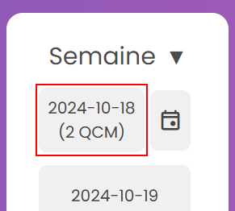
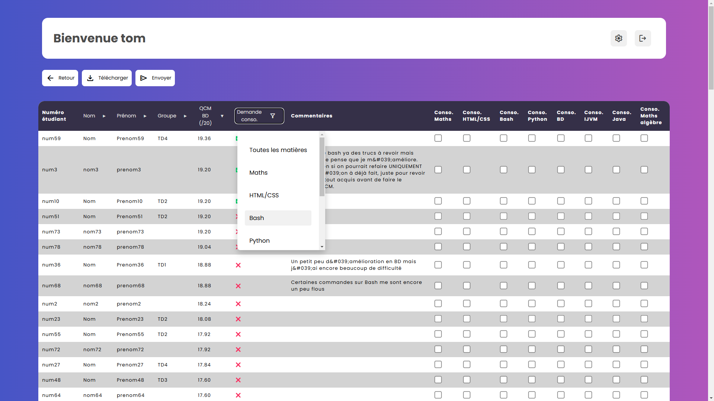
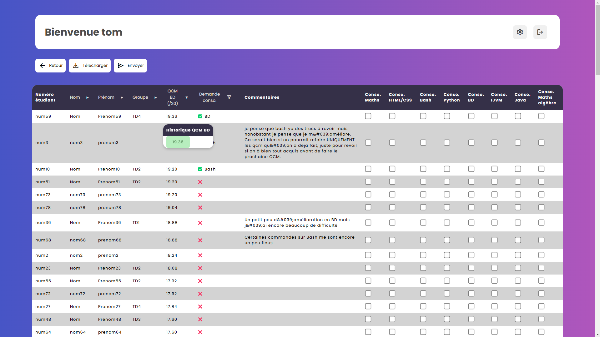
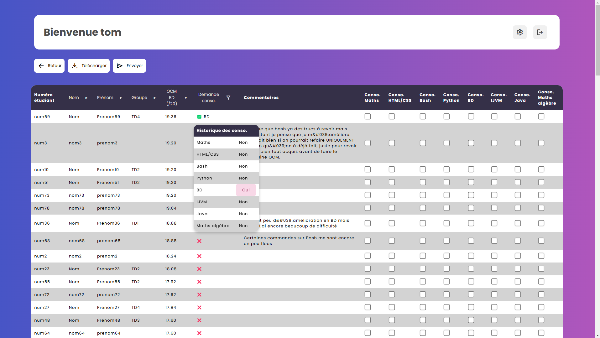

# 🗒️ Affichage des bilans
Ce guide explique comment utiliser l'affichage des bilans.

---
## 🗒️ Accèder aux bilans
Pour accéder à un bilan, il suffit de cliqué sur le bouton correspondant à la semaine souhaité sur la page d'accueil:  
  

On se retrouvera ensuite sur cette page :
  

## 🔎 Trier les bilans
En cliquant sur les en-tête on pourra trier par différents critères (Nom, Prénom, et groupe de TD), et en cliquant sur l'en-tête ```Demande conso.``` on pourra filtrer les matières demandés.
  

## 🧐 Affichage avancé

En mettant sa souris au dessus d'une note, on verra l'historique des notes précédentes de l'étudiant.

  
En mettant sa souris au dessus d'une demande de conso, on verra l'historique des demandes. Avec marqué ```Oui``` s'il a demandé conso. ou ```Non``` sinon ainsi qu'un un code couleur :  

- Vert, s'il a demandé conso. et qu'il y est allé.  
* Rouge, s'il a demandé conso. mais qu'il n'y a pas été accepté  
* Noir, s'il a été absent à un cours de conso.  
