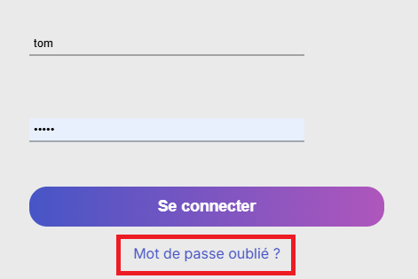
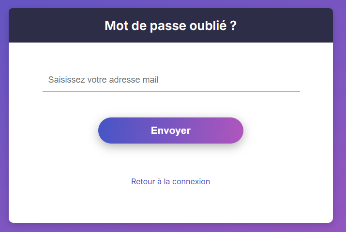

# 🤓 Gestion du compte

--- 

## Création d'un compte
Pour créer un compte, il suffit d'executer la commande suivante:
=== "Avec Docker" 
    ``` bash
    $ docker-compose exec web python manage.py createsuperuser
    ```

=== "Sans docker"
    ``` bash
    $ python manage.py createsuperuser
    ```

Et de remplir les champs demandés.

--- 

## Connexion


--- 

## Mot de passe oublié
La page de permettant de réinitialiser son mot de passe est accessible depuis la page de connexion, après un clic sur le bouton ```Mot de passe oublié ?``` :  



Cette page permet à l'utilisateur de renseigner une adresse e-mail, qui permettra à l'application d'envoyer un mail de réinitialisation de mot de passe :  

