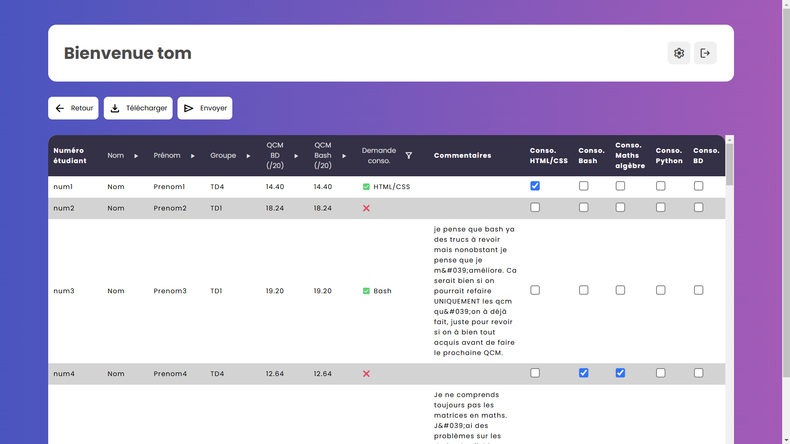
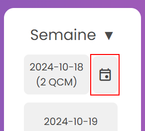
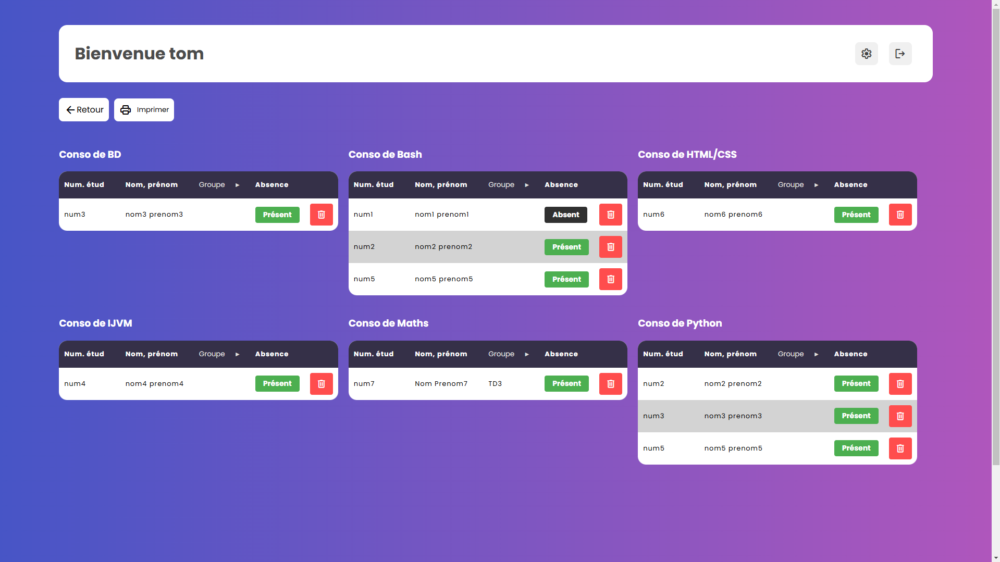

# 🏛️ Gestion des consolidations
Ce guide explique comment créer, afficher les consolidations, ainsi que mettre des étudiants absent, et les désinscrires.

## ➕ Créer une consolidations
Pour créer une consultation, il faut d'abord se rendre sur une page de bilan.

Choissiez les étudiants à envoyer en consolidation en cliquant sur les cases à cochées (Par exemple dans la capture d'écran on souhaite envoyer `num4` en consolidation bash et maths algèbres).  

Une fois tout les étudiants choisis, vous pouvez cliquer sur envoyer en haut à gauche.

## 🎯 Accéder aux consolidations
  
Pour accèder à aux consolidations d'une semaine, il suffit d'appuyer sur l'icon de calendrier sur le semaine que l'on souhaite sur la page principale. Si aucune consolidation n'est créée pour cette semaine, le boutton ne s'affichera pas.

## 🔧 Gérer des consolidations
Après avoir envoyé des étudiant en consolidation ou après avoir cliquer sur une semaine, on se retrouve sur cette page:
  
Ici on peut voir toute les consos créés, ainsi que les étudiant inscrits. En cliquant sur le bouton ```Présent``` on peu mettre un étudiant absent. En cliquant sur la poubelle on peu désinscrire un étudiant d'une conso.
