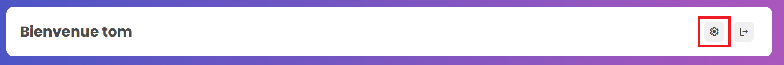
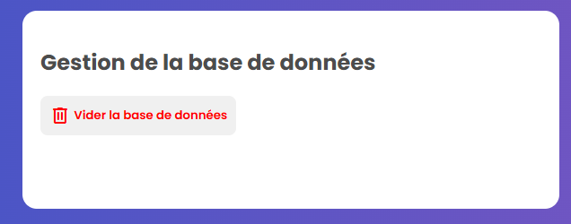
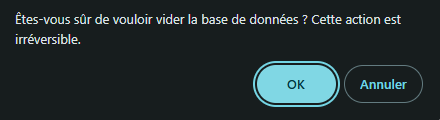
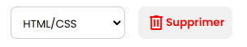

# ⚙️ Paramétrage
Ce guide explique quels sont les différents paramètres disponibles et comment les utiliser.

---

La page de paramétrage est accessible après un clique sur le bouton contenant un engrenage, présent en haut à droite sur chacune des pages de l'application :  



Une fois arrivé sur cette page, l'utilisateur a la possibilité d'effectuer plusieurs actions en lien avec la base de données.  


Il est possible de vider la base de données existante, en appuyant sur le bouton ```Vider la base de données```, ce qui demandera une confirmation avant de s'effectuer.  
**Attention !** Les matières ne seront pas supprimées.     




Les paramètres permettent également de gérer les matières stockées dans la base de données.  


Il est possible d'ajouter des matières en renseignant le titre de la matière souhaitée, dans le champ prévu à cet effet, puis en cliquant sur le bouton ```Ajouter``` :  


Un message de confirmation s'affichera.

De plus, les matières existantes peuvent être supprimées en sélectionnant la matière souhaitée, puis en cliquant sur le bouton ```Supprimer``` :  



Un message de confirmation s'affichera.

---