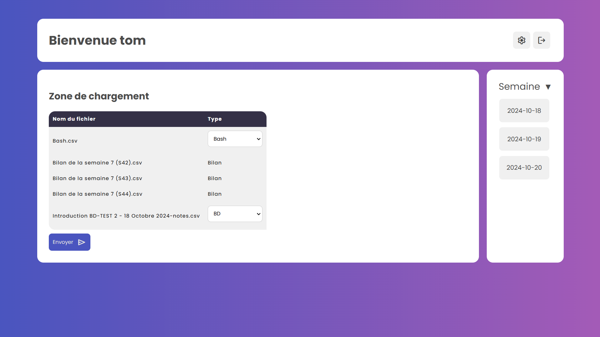
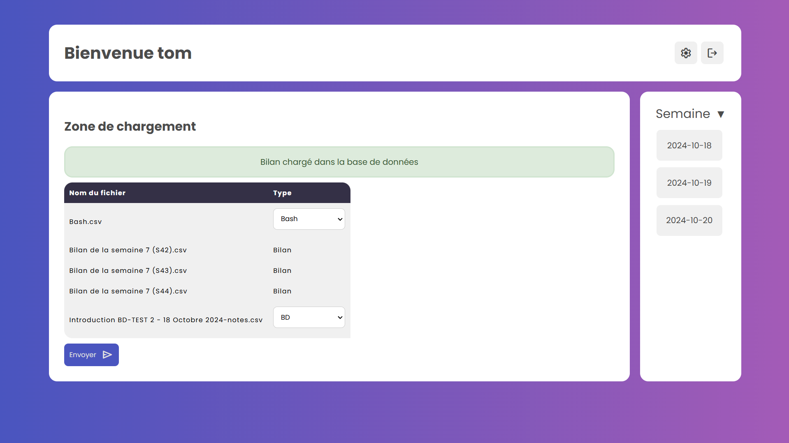

# 📂 Chargement des fichiers
Ce guide explique comment charger des bilans et des QCM dans l'application.

---

Quand l'utilisateur se connecte il sera directement rediriger vers cette page:


L'utilisateur a la possibilité de charger des fichiers (QCM ou bilan au format csv) soit en cliquant sur le bouton ```Choisir un fichier```, soit en drag and droppant les fichiers dans la zone.


Une fois les fichiers chargés, le type est automatiquement detecté. Si il sagit d'un bilan, rien n'est à faire, sinon le site vas detecter de quelle matière il sagit en fonction du titre. Si le titre est mal formaté, il faudra choisir la matière dans le menu déroulant.  
Si la matière n'est pas présente, voir : [Comment rajouter une matière](/settings)

Une fois que tout semble correcte, cliquez sur le boutton envoyer pour extraire les données et les sauvegarder en base de données.


Un message de confirmation s'affichera.

---
[Consulter un bilan →](/bilan)